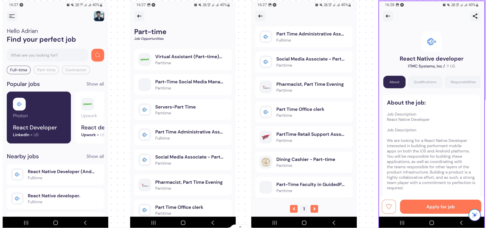
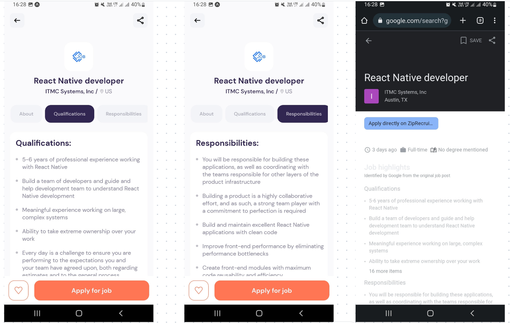

## App link

[Link](https://expo.dev/@harikrishna147/react_native_jobs?serviceType=classic&distribution=expo-go)

## Job Search App with React Native
- used [`JSearch API`](https://rapidapi.com/letscrape-6bRBa3QguO5/api/jsearch) to fetch jobs posted on LinkedIn, Indeed, Glassdoor, ZipRecruiter, BeBee and many others platforms
- implemented search & pagination functionality
- clean, organized, and maintainable code with proper architecture
- followed the best practices for React Native development
- developed visually appealing UI/UX designs







# Expo Router Example

Use [`expo-router`](https://expo.github.io/router) to build native navigation using files in the `app/` directory.

## 🚀 How to use

```sh
npx create-expo-app -e with-router
```

## 📝 Notes

- [Expo Router: Docs](https://expo.github.io/router)
- [Expo Router: Repo](https://github.com/expo/router)

